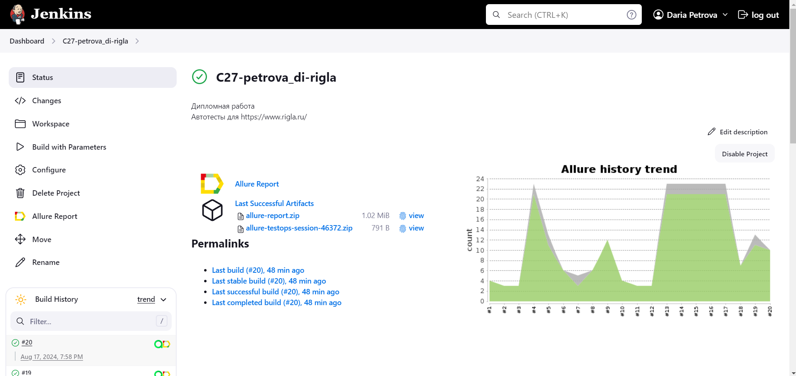
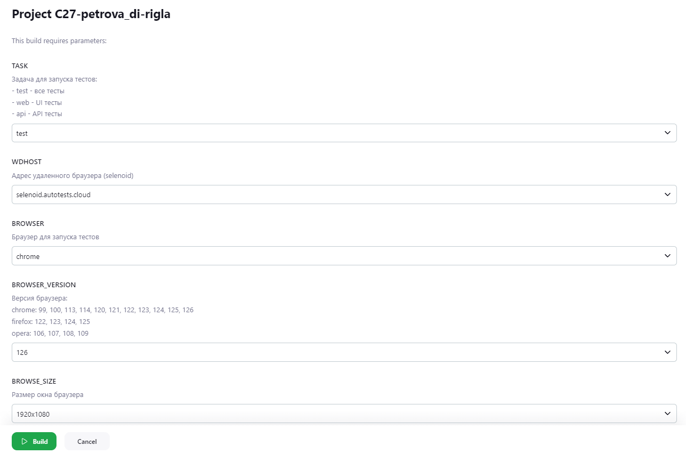

# Проект по автоматизации тестирования сайта сети аптек [](https://rigla.ru/)
>Наши аптеки – это многопрофильные центры здоровья и красоты европейского уровня. Мы уверены, что успеха и благополучия гораздо легче добиться здоровым людям. Жить полной жизнью, использовать каждый шанс, который дает фортуна, – такова философия современного человека. Не тратьте времени на болезни, улыбайтесь людям, занимайтесь спортом, гордитесь собой, путешествуйте и уверенно идите к своей цели!

## :receipt: Содержание
- [Используемый стек](#computer-используемый-стек)
- [Описание проекта](#bookmark_tabs-описание-проекта)
- [Реализованные проверки](#heavy_check_mark-реализованные-проверки)
  - [UI тесты](#pencil2-ui-тесты)
  - [API тесты](#pencil2-api-тесты)
  - [Ручные тесты](#pencil2-ручные-тесты)
- [Запуск тестов](#large_blue_circle-запуск-тестов)
  - [Локальный запуск](#desktop_computer-локальный-запуск)
  - [Удаленный запуск на Selenoid](#robot-удаленный-запуск-на-selenoid)
  - [Сборка в Jenkins](#-сборка-в-jenkins)
- [Allure-отчет](#-allure-отчет)
- [Allure-TestOps](#-allure-testops)
- [Задача в JIRA](#-задача-в-jira)
- [Уведомления в Telegram](#-уведомления-в-telegram)
- [Видео примера запуска тестов в Selenoid](#-видео-примера-запуска-тестов-в-selenoid)

## :computer: Используемый стек
<p align="center">
<a href="https://www.jetbrains.com/idea/"></a>
<a href="https://www.java.com/"></a>
<a href="https://selenide.org/"></a>
<a href="https://aerokube.com/selenoid/"></a>
<a href="https://github.com/allure-framework/allure2"></a>
<a href="https://qameta.io/"></a>
<a href="https://gradle.org/"></a>
<a href="https://junit.org/junit5/"></a>
<a href="https://github.com/"></a>
<a href="https://www.jenkins.io/"></a>
<a href="https://telegram.org/"></a>
<a href="https://www.atlassian.com/ru/software/jira"></a>
</p>


## :bookmark_tabs: Описание проекта

- Проект состоит из UI, API и ручных тестов
- Ручные тесты добавлены в ```Allure TestOps```
- Автоматические тесты реализованы на языке ```Java```
- В качестве сборщика используется ```Gradle```
- Используются фреймворки ```JUnit 5``` и ```Selenide```
- Используется технология ```Owner``` для конфигурации тестов
- Используется ```Lombok``` для моделей в API тестах
- При запуске тестов браузер может запускаться локально или в ```Selenoid```
- Реализована возможность запуска тестов в ```Jenkins```
- Реализована возможность запуска тестов из ```Allure TestOps```
- Реализована интеграция с ```Jira```
- Настроена отправка уведомлений о результатах прохождения в чат-бот ```Telegram```
- По завершении прохождения автотестов генерируется ```Allure Report```

---

## :heavy_check_mark: Реализованные проверки

### :pencil2: UI тесты
:green_circle: Авторизация
- Успешный логин
- Неуспешный логин из-за капчи
- Неуспешный логин без почты
- Неуспешный логин без пароля
- Неуспешный логин с неверными кредами

:green_circle: Избранные товары
- Добавление продукта в Избранное
- Удаление продукта из Избранного

:green_circle: Корзина
- Добавление товара в корзину
- Добавление двух одинаковых товаров в корзину через +
- Увеличение количества продукта в корзине
- Уменьшение количества продукта в корзине
- Удаление продукта из корзины
- Очистка корзины

### :pencil2: API тесты
:green_circle: Избранные товары
- Добавление товара в избранное
- Добавление несуществующего товара в избранное
- Добавление товара в избранное дважды
- Добавление товара в избранное без авторизации
- Удаление товара из избранного
- Удаление товара с несуществующим id из избранного
- Удаление товара из избранного без авторизации
- Получение списка товаров из избранного
- Получение пустого списка товаров из избранного
- Получение списка товаров из избранного без авторизации

### :pencil2: Ручные тесты
- Успешный логин с почтой и паролем
- Получение списка избранных товаров с несколькими товарами

---

## :large_blue_circle: Запуск тестов

## :desktop_computer: Локальный запуск
Параметры для локального запуска в терминале IDE:
- тег/задача
  - ```test``` - все тесты
  - ```web``` - UI тесты
  - ```api``` - API тесты
- где запускать браузер
  -  ```-DisRemote=false``` - или не указывать этот параметр совсем, т.к. значение по умолчанию - false (== запускаем браузер локально)
- логин и пароль
  - ```-Demail``` и ```-Dpassword``` - только для UI тестов. Но т.к. на сайте невозможно обмануть капчу и несколько тестов помечены как Disabled, то можно указать абсолютно любые логин и пароль
- настройки браузера
  - ```-Dbrowser```, ```-DbrowserVersion```, ```-DbrowseSize``` - если не указывать, то используются значения по умолчанию (заданные в local.properties)


```java
gradle clean test -Demail="test_email@gmail.com" -Dpassword="123456"

gradle clean web
-Demail="test_email@gmail.com"
-Dpassword="123456"
-DisRemote=false
-Dbrowser=firefox
-DbrowserVersion=125
-DbrowseSize=1600x1200

gradle clean api
```

## :robot: Удаленный запуск на Selenoid
Параметры для удаленного запуска в терминале IDE:
- тег/задача
  - ```test``` - все тесты
  - ```web``` - UI тесты
  - ```api``` - API тесты
- где запускать браузер
  -  ```-DisRemote=true```
  -  ```-DwdHost=selenoid.autotests.cloud```
  -  ```-DselenoidLogin=...```
  -  ```-DselenoidPassword=...```
- логин и пароль
  - ```-Demail``` и ```-Dpassword``` - только для UI тестов. Но т.к. на сайте невозможно обмануть капчу и несколько тестов помечены как Disabled, то можно указать абсолютно любые логин и пароль
- настройки браузера
  - ```-Dbrowser```, ```-DbrowserVersion```, ```-DbrowseSize``` - если не указывать, то используются значения по умолчанию (заданные в remote.properties). В Selenoid ферме представлены не все браузеры и не все версии, поэтому указывать можно только те, которые там имеются:
    - chrome: 99, 100, 113, 114, 120, 121, 122, 123, 124, 125, 126
    - firefox: 122, 123, 124, 125
    - opera: 106, 107, 108, 109

```java
gradle clean test
-DisRemote=true
-Demail="test_email@gmail.com"
-Dpassword="123456"
-DwdHost=selenoid.autotests.cloud
-DselenoidLogin=...
-DselenoidPassword=...

gradle clean web
-DisRemote=true
-Demail="test_email@gmail.com"
-Dpassword="123456"
-DwdHost=selenoid.autotests.cloud
-DselenoidLogin=...
-DselenoidPassword=...
-Dbrowser=firefox
-DbrowserVersion=122
-DbrowseSize=1920x1200

gradle clean api
-DisRemote=true
-DwdHost=selenoid.autotests.cloud
-DselenoidLogin=...
-DselenoidPassword=...
```

##  Сборка в Jenkins
[](https://jenkins.autotests.cloud/job/C27-petrova_di-rigla/)

### :writing_hand: Параметры сборки в Jenkins, задаваемые пользователем
[](https://jenkins.autotests.cloud/job/C27-petrova_di-rigla/build?delay=0sec)

```TASK``` - название задачи. Значение по умолчанию - ```test```  
```WDHOST``` - адрес удаленного браузера (selenoid). Значение - ```selenoid.autotests.cloud```  
```BROWSER``` - браузер для запуска тестов. Значение по умолчанию - ```chrome```  
```BROWSER_VERSION``` - версия браузера. Значение по умолчанию - ```126```  
```BROWSE_SIZE``` - размер окна браузера. Значение по умолчанию - ```1920x1080```  

### :arrow_right: Параметры сборки в Jenkins, передаваемые из установленных значений:

```USER_EMAIL``` - логин пользователя на сайте rigla.ru  
```USER_PASSWORD``` - пароль пользователя на сайте rigla.ru  
```SELENOID_LOGIN``` - логин пользователя для Selenoid фермы  
```SELENOID_PASSWORD``` - пароль пользователя для Selenoid фермы  

```java
clean
${TASK}
-DwdHost=${WDHOST}
-Dbrowser=${BROWSER}
-DbrowserVersion=${BROWSER_VERSION}
-DbrowseSize=${BROWSE_SIZE}
-Demail=${USER_EMAIL}
-Dpassword=${USER_PASSWORD}
-DselenoidLogin=${SELENOID_LOGIN}
-DselenoidPassword=${SELENOID_PASSWORD}
-DisRemote="true"
```

:gear: Запуск в Jenkins:
1. Перейти в сборку
2. Нажать ```Собрать с параметрами```/```Build with parameters```
3. Выбрать значения или оставить установленные по умолчанию
4. Нажать ```Собрать```/```Build```

---

##  Allure-отчет
После выполнения сборки в Jenkins формируется отчет в Allure.  
В блоке ```История сборок/Build History``` напротив конкретной сборки отображается значок [](https://jenkins.autotests.cloud/job/C27-petrova_di-rigla/20/allure/), при нажатии на который открывается страница со сформированным html-отчетом и тестовой документацией.
